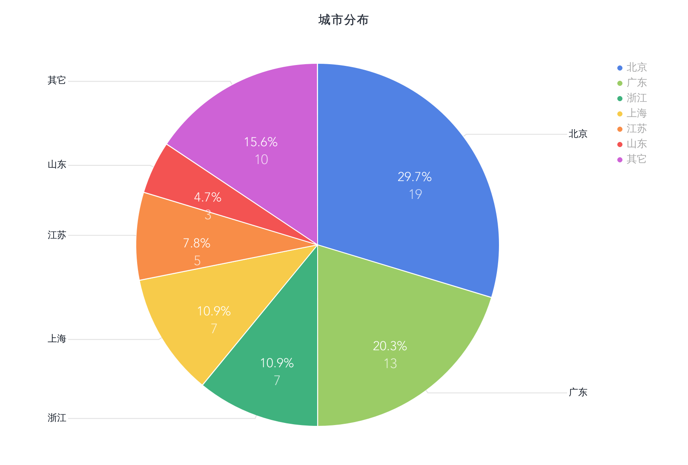

# 应届程序员工资水平调查

此问卷为了调查应届生第一份工资的的工资，帮助大家了解国内应届程序员的工资水平，也给后来的毕业生一些指导。  

问卷会一直保留，有兴趣的人可以继续填写，我会不定期更新结果

* 问卷地址： [https://www.wjx.cn/jq/47220186.aspx](https://www.wjx.cn/jq/47220186.aspx)
* 结果地址：[https://zhucekaze.github.io/yjgz/](https://zhucekaze.github.io/yjgz/)

# 结果

** 结果仅供参考！！ **

* 截止：2019.10.19
* 参与人数：95
* 有效问卷数：64
* csv文件说明（在项目中可下载）：
  * 1.csv：有效问卷
  * 2.csv：无效问卷
  * 3.csv：博士问卷（由于人数太少，不统计到结果中）
* 所有图表在线地址：[https://me.bdp.cn/share/index.html?shareId=sdo_115c362229a07a87e862dfb3814000c5](https://me.bdp.cn/share/index.html?shareId=sdo_115c362229a07a87e862dfb3814000c5)

## 城市分布
选择在北京的人数最多，有19人，其次是广东(13)，上海(7)，浙江(7)。由于其他城市人数过少，后面的一些统计会针对前4的城市进行过滤。

---

---

